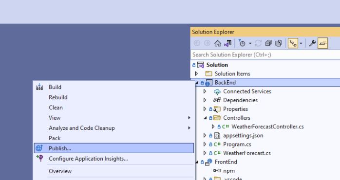
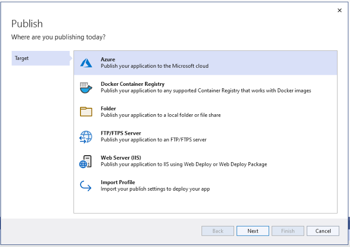
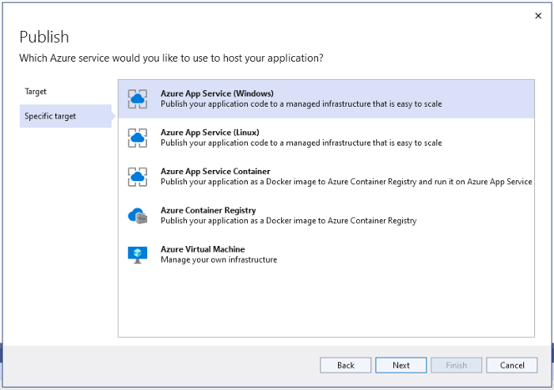
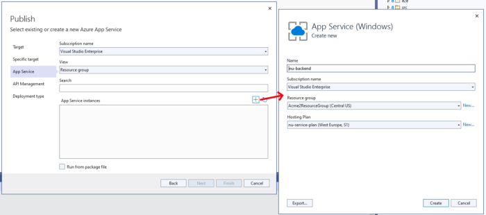
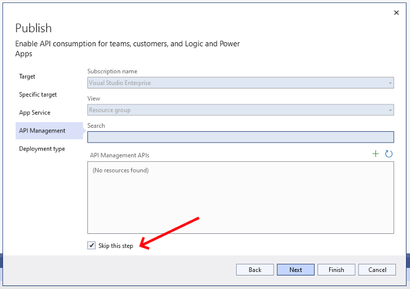
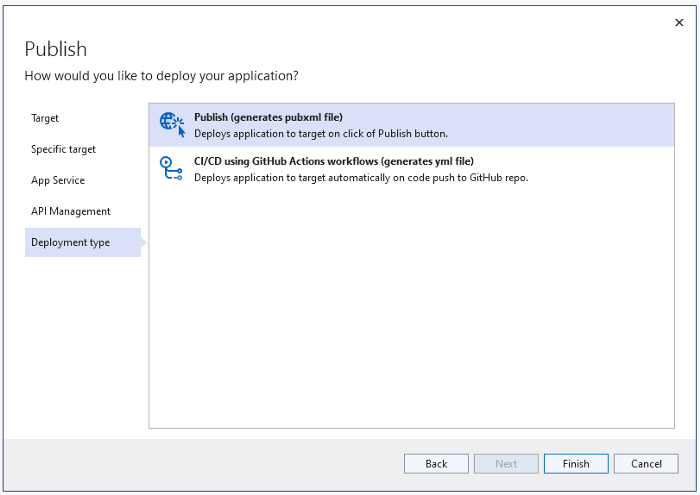
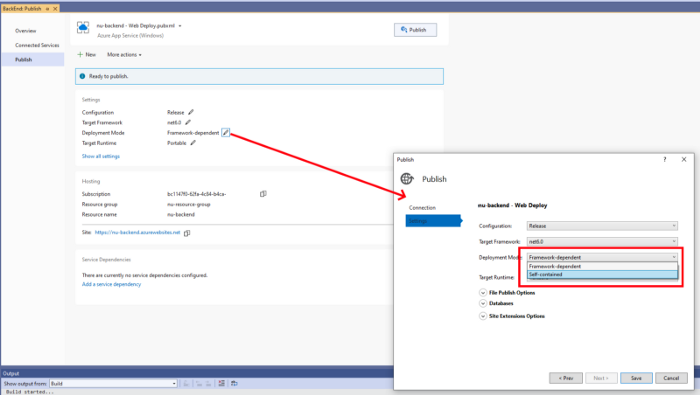
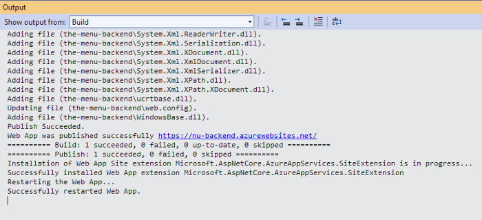
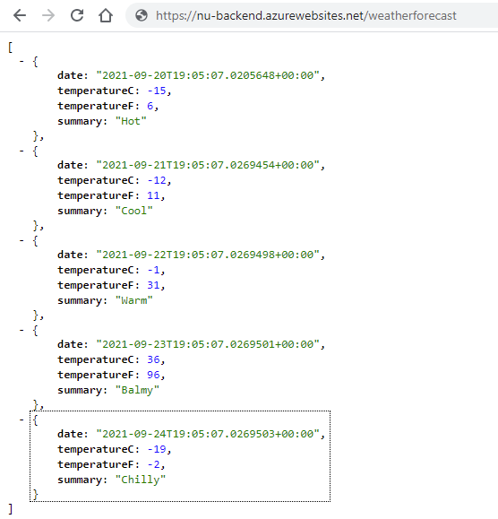

# Prerequisites

- Set up a .NET 6 app and ensure that it’s running locally — see https://docs.microsoft.com/en-us/visualstudio/javascript/tutorial-asp-net-core-with-angular?view=vs-2022
- Set up a free Azure account at https://azure.microsoft.com/en-us/free/

# Steps

Right-click your backend project, hit Publish…

Choose Azure in the Target step

Let’s go with Azure App Service here

Create a Resource Group and a Hosting Plan here, if you don’t have them already.

Let’s just skip the API Management part

Choose the first option here — Publish.

Almost there… Change Deployment Mode from “Framework-dependent” to “Self-contained”

Now hit Publish, and wait for it to do its thing:

Good, let’s see if that worked. Open your browser and check that the /weatherforecast endpoint is working. You should see something like this:

Yay! Your backend is now up and running in Azure!