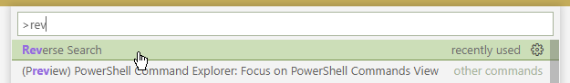
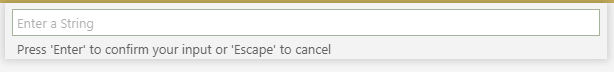
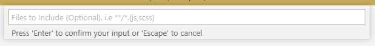
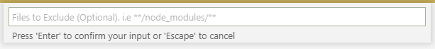
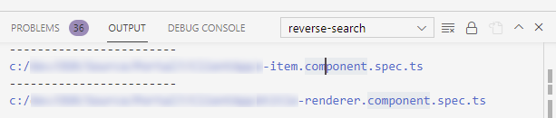

I was running a Karma test suite containing a few hundred unit tests, when I got into this error:

```js
Can’t bind to ‘some-property’ since it isn’t a
known property of ‘some-component’
```

Now, I happen to know that this is caused by a missing [NO_ERRORS_SCHEMA] in one or more of the spec files.

But — the Karma tests runner does not provide any info about the actual names of the files having this issue.

So — how to solve this problem then: “get a list of all \*.spec.ts files in my project that do not contain the ‘NO_ERRORS_SCHEMA’ string”?

Luckily, there’s a Visual Studio Code extension for that:
[ReverseSearch](https://marketplace.visualstudio.com/items?itemName=DanishSarwar.reverse-search).
Once installed, do this:

1. Press Ctrl + P, open Reverse Search:



2. Enter a string. We'll use "NO_ERRORS_SCHEMA" here:



3. Choose files to include. We'll use "\*_/_.component.spec.ts" here:



4. Choose files to exclude. We'll use "!\*_/_.component.spec.ts" here:



5. Done! Matching files will be presented in the Output panel:



Cool, right?
